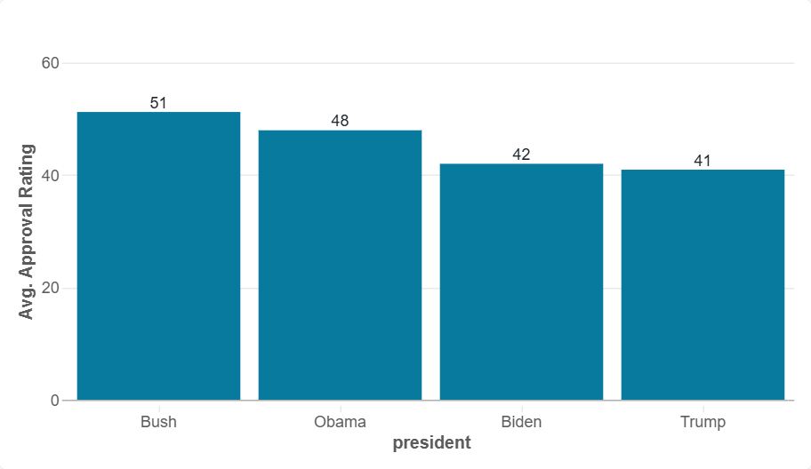
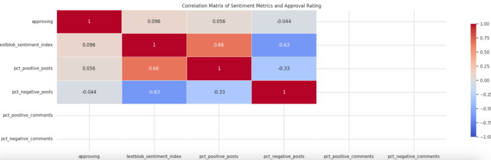

# Predicting Presidential Approval Rating with Reddit Comment Sentiment
By Daniel Cardenas Sanchez, Holt Cochran, Sam Cohen, Gabriel Soto, & Vaishnavi Singh

## Motivation & Background
Many politicos complain about the accuracy of polls during presidential, state, and federal election cycles. While issues with public perception of polling accuracy are nothing new, some of the unconventional and non-traditional ways to predict outcomes nowadays are: For instance, Polymarket–an online betting platform–outperformed most traditional pollsters in predicting Donlad Trump as the winner of the 2024 presidential election. 

For this project, we wanted to employ a similar non-traditional prediction method, and see if a model trained on the sentiment of reddit comments about sitting presidents could yield similar approval rating results to actual polls. Findings could potentially produce a way to gauge approval rating without the need for extensive polling more broadly, or at the very least, augment pollsters’ findings. 

Our GitHub repository containing the code used for this project can be found [here](https://github.com/holtcochran/PPOL5206-FinalProject/tree/main). 

---
## Data
Our data came from 2 main sources: 

**Presidential Approval Rating**
- Scraped from website of the [American Presidency Project](https://www.presidency.ucsb.edu/statistics/data/presidential-job-approval-all-data)
- Aggregated at the weekly level
- Data collected by Gallup
  
**Reddit Comments**
- Retrieved using the [Reddit API](https://developers.reddit.com/docs/0.9/api)
- Comments and posts about presidents (Obama, Trump, Biden)
- Date range: 2009-2025

Final data sets were compiled at the weekly (n=796) and daily level (n=5,885). The schema of the final data set was as follows (note that this is an example):

| Date       | Sentiment Score (Subreddit 1) | Sentiment Score (Subreddit 2) | ... | Approval Rate (%) |
|------------|-------------------------------|-------------------------------|-----|--------------------|
| 2023-01-01 | 0.12                          | 0.09                          | ... | 45                 |
| 2023-01-08 | 0.18                          | -0.14                         | ... | 47                 |
| 2023-01-15 | 0.15                          | 0.13                          | ... | 46                 |
| 2023-01-22 | -0.10                         | 0.08                          | ... | 44                 |

*Please note: because of the size data files and privacy concerns listed by the Reddit API, we were not able to upload a full version of the final data sets to our GitHub repisitory. However, a sample of the data may be available upon request.

---
## Methodology: Model & Pipeline in Databricks
Once data were collected, we utilized Databricks for its cloud, Spark, and pipeline capabilities. This included the following steps:

*Sentiment Analysis*: Generating sentiment scores (ranging from -1 to 1) for reddit comment text (TextBlob package used)

*Data Merging*: Sentiment scores were aggregated by mean for subreddits and the daily and weekly level. This was then merged with approval rating by date

*Model Training*: An XGboost model was then trained using the subreddit sentiment and input features, with the target feature being approval rating. The XGboost algorithm was chosen for its accuracy and ability to handle null values. We tested two different XGboost models: one predicting weekly approval ratings using comment sentiment aggregated by mean at the lagged weekly level (n=796) to account for delays in reporting, and one at the daily level (n=5,885). 

The pipeline follows this general path:

A preliminary Python notebook used to compile and merge the data, calculate sentiment, and train early versions of the models can be found here:
<iframe src="https://sec178.github.io/ppol5206_presapproval.github.io/code/sentiment_approval_pipeline.html" width="100%" height="600px"></iframe>

  
Click to see more of the final code notebooks for our project

  
  <a href="https://github.com/holtcochran/PPOL5206-FinalProject/blob/main/approval/notebooks/approval_rating/mdf_presapproval.ipynb" style="display: inline-block; padding: 10px 20px; margin: 5px; background-color: #007BFF; color: white; text-decoration: none; border-radius: 5px;">Approval scraping script</a>

  <a href="https://github.com/holtcochran/PPOL5206-FinalProject/blob/main/approval/scripts/reddit_api.py" style="display: inline-block; padding: 10px 20px; margin: 5px; background-color: #28a745; color: white; text-decoration: none; border-radius: 5px;">Reddit API code</a>

  <a href="https://github.com/holtcochran/PPOL5206-FinalProject/tree/main/approval/notebooks" style="display: inline-block; padding: 10px 20px; margin: 5px; background-color: #ffc107; color: white; text-decoration: none; border-radius: 5px;">"Medallion" Pipeline: Ingestion (bronze), analysis (silver), consolidation (gold)</a>

---
## Exploratory Data Analysis

We also used Databricks' dashboard functionality to visually explore our data:
 

---
## Findings

The lagged weekly model had an Mean Absolute Error of 3.4, with a Root Mean Squared Error of 4.36:  

The daily model had a Mean Absolute Error of 3.1, with a Root Mean Squared Error of 4.08:

Both models had relatively high R-squared values (0.54 and 0.42, respectively), indicating a relatively high proportion of variance explained by the model. 

---
Despite some clear drawbacks to this model pipeline and project (relatively low number of observations, sparsity, inability to guage representative samples, online bias, etc.), the scope of this project is promising: it is relatively easy to keep improving this pipeline, and to continually enhance the model over time. In addition, due to the cloud and use of big data architecture through Databricks, it can be scaled upward if necessary. Findings and predictions can lead to more responsive governance, early warnings for political shifts, and improved public engagement.

